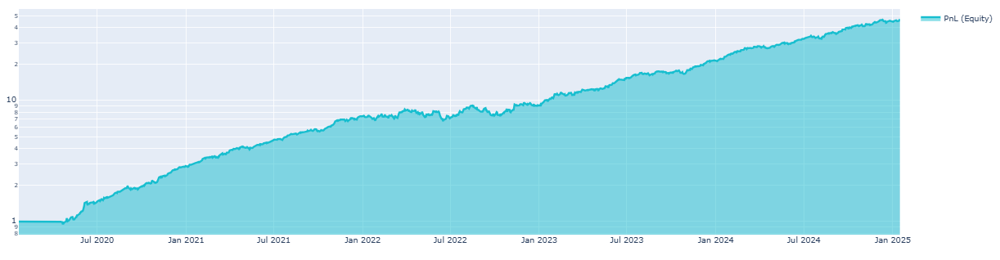
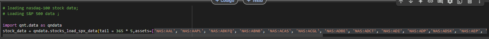
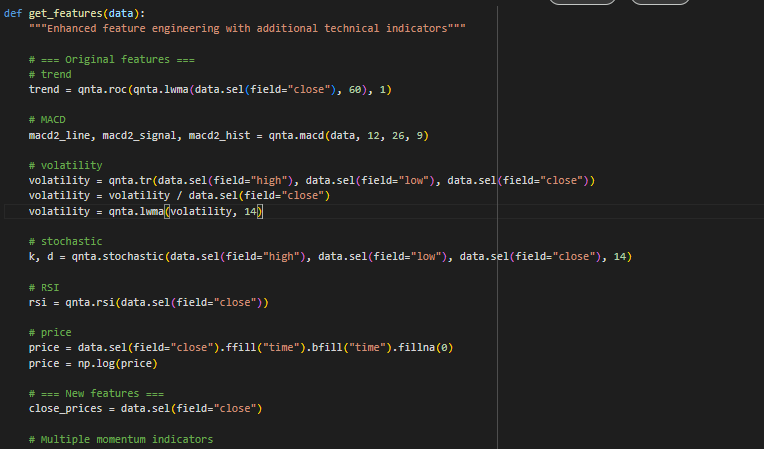
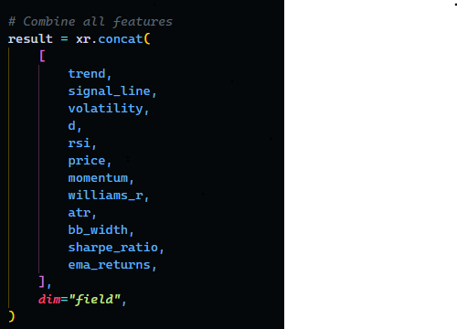
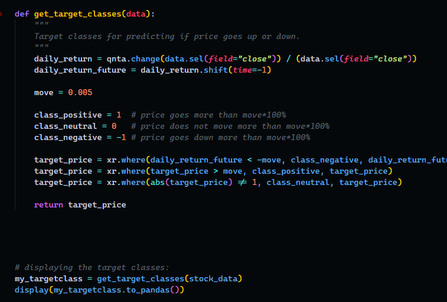
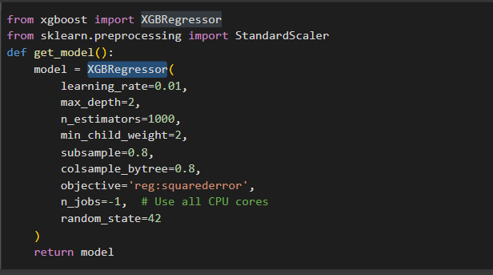

# LAB ATQ - MLPRegressor

Este laboratorio tiene la finalidad de predecir el precio de las acciones de una cartera de acciones para el parcial de Metodos.

## Imagen del Sharpe Ratio

## Configuration

- sharpe_ratio: 5.127

- Market : S&P 500
  

- Assets : ['NAS:AAL', 'NAS:AAPL', 'NAS:ABKFQ', 'NAS:ABNB', 'NAS:ACAS', 'NAS:ACGL', 'NAS:ADBE', 'NAS:ADCT', 'NAS:ADI', 'NAS:ADP','NAS:ADSK', 'NAS:AEP', 'NAS:AKAM', 'NAS:ALGN', 'NAS:ALTR', 'NAS:ALTR1', 'NAS:ALXN', 'NAS:AMAT', 'NAS:AMCC', 'NAS:AMD']
  
- Features : I change the features to the ones that I think are more relevant.****
  
- variables : I change the variables to the ones that I think are more relevant.
  

- targets : i change the targets to the simulate using the actually price of the stock.
  

- Model : XGBRegressor
- 
  
