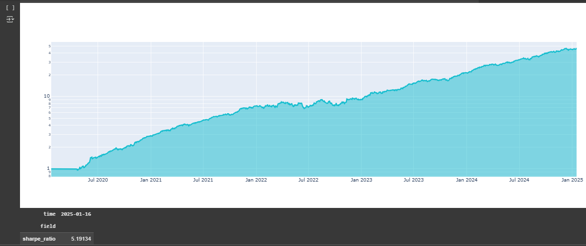

# LAB ATQ - MLPRegressor

Este laboratorio tiene la finalidad de predecir el precio de las acciones de una cartera de acciones.

## Imagen del Sharpe Ratio

## Configuration
* sharpe_ratio: 5.19

* Market : S&P 500

* Assets : ['NAS:AAL', 'NAS:AAPL', 'NAS:ABKFQ', 'NAS:ABNB', 'NAS:ACAS', 'NAS:ACGL', 'NAS:ADBE', 'NAS:ADCT', 'NAS:ADI', 'NAS:ADP','NAS:ADSK', 'NAS:AEP', 'NAS:AKAM', 'NAS:ALGN', 'NAS:ALTR', 'NAS:ALTR~1', 'NAS:ALXN', 'NAS:AMAT', 'NAS:AMCC', 'NAS:AMD']

* The variables: I got problems using other variables. In that way I leave the same variables that came with the example code.****